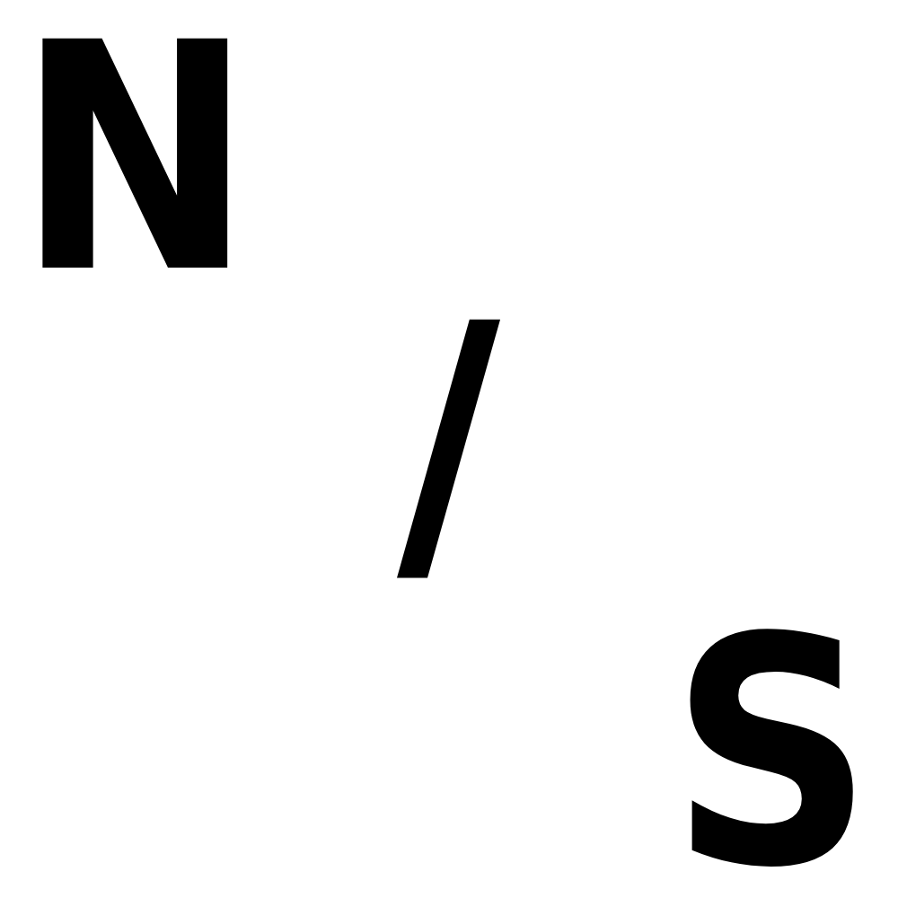

# N/Script



[](https://github.com/nslashtech/NSlashScript/releases)
[](https://github.com/nslashtech/NSlashScript/issues)
[](https://github.com/nslashtech/NSlashScript)

N/Script is a programming language based on Python. The language is aimed at programs

# Installing
- Install a repo
- extract it in any folder
- Create in ```NSScript path/Projects``` file ```main.nss```
- Open ```Interpreter.py``` and write ```nslash1 main.nss``` for open main.nss

# Syntax
the syntax in n/script is based on classes and functions, for example, to write output text to the console you need to write ```console.say("")```
where "console" is a class, "say" is a function and the value is in parentheses. Almost all code adheres to this principle except for variables. They are written in the same way as in Python.

Read the full documentation, link attached above

# Programm e.g
```
# Variables
x = 5

# Console
console.input("Enter your name: ")
console.say("Hello, input!")
console.say("x")

# Calculate
math(4 < 3)
math(3 - 5)
```

# Authors
- Dave "SynthouS"
- Maksim "Flow1zz"
